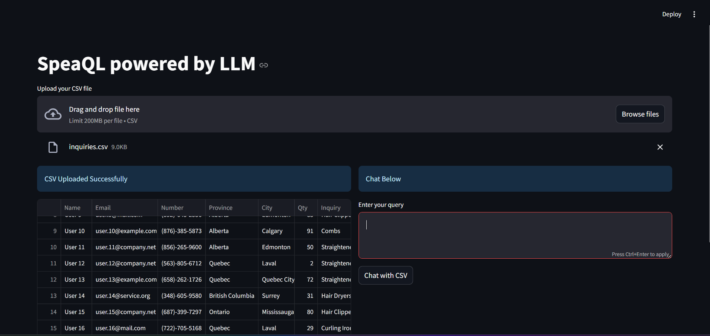

# SpeakQL  
**The All-in-One Suite for Natural Language to SQL & CSV Interactions, Powered by LangChain**

## Overview 

SpeakQL is an AI-powered platform that revolutionizes the way you interact with databases and CSV files. Whether you're querying a SQL database or exploring CSV datasets, SpeakQL allows you to communicate in natural language—removing the need for complex SQL or manual data manipulation.




With the power of OpenAI and LangChain, SpeakQL enables intuitive conversations about your data. Just ask questions, and let the platform handle everything from SQL query generation to CSV analysis.

## Key Features ✨
- **Natural Language to SQL (NL2SQL)**: Easily translate questions into SQL queries to interact with your database without needing to write SQL code.
- **Natural Language to CSV Insights**: Ask questions about your CSV data, and SpeakQL will provide answers, insights, and visualizations.
- **LangChain Chatbot Integration**: Chat with your data directly using a conversational agent that handles both SQL and CSV-based data exploration.
- **Enhanced Data Accessibility**: From SQL databases to static CSV files, interact with your data seamlessly using plain English.
- **OpenAI & LangChain Integration**: State-of-the-art natural language understanding powers accurate SQL and CSV data insights.
- **Streamlit Interface**: An intuitive and interactive interface to work with both SQL databases and CSV files.

## Tech Stack 🛠️
- **Python**: Core functionality for data querying and processing.
- **LangChain**: Chatbot framework for conversational data interactions.
- **OpenAI API**: For natural language understanding and query generation.
- **SQLAlchemy**: Manages SQL databases and executes generated queries.
- **Streamlit**: Provides a user-friendly interface for both SQL and CSV operations.
- **Pandas & PandasAI**: For CSV data manipulation and analysis.
  
## How It Works 💡

1. **Ask in Plain English**: Whether you're working with a SQL database or a CSV file, you can ask questions like "What are the top 10 selling products?" or "Show me data for purchases made last month."
   
2. **SQL Query or CSV Insights**: 
   - For SQL databases, SpeakQL will generate and run the necessary SQL queries.
   - For CSV files, SpeakQL uses PandasAI to answer questions and provide insights.

3. **Chat with Your Data**: Use the LangChain-powered chatbot to ask follow-up questions, refine queries, or explore your data in a natural dialogue.

## Usage 🔧

### Installation

```bash
git clone https://github.com/yourusername/speakql.git
cd speakql
pip install -r requirements.txt
```

### Running the App

```bash
streamlit run app.py
```

### Example Queries

1. **SQL Example**  
   Input: **"Show me the top 5 customers by sales."**  
   SpeakQL will generate the SQL query:
   ```sql
   SELECT customer_name, SUM(sales) 
   FROM sales_data 
   GROUP BY customer_name 
   ORDER BY SUM(sales) DESC 
   LIMIT 5;
   ```

2. **CSV Example**  
   Input: **"What’s the average purchase value in this CSV?"**  
   SpeakQL will analyze the CSV data using PandasAI and provide the result.

## Versions and Extensibility 🔍

SpeakQL unifies two powerful modes of data interaction:
- **SQL Database Mode**: Perfect for users who need to perform dynamic queries on relational databases.
- **CSV Analysis Mode**: Ideal for those working with static data in CSV format, with all the power of Pandas for analysis and visualization.

